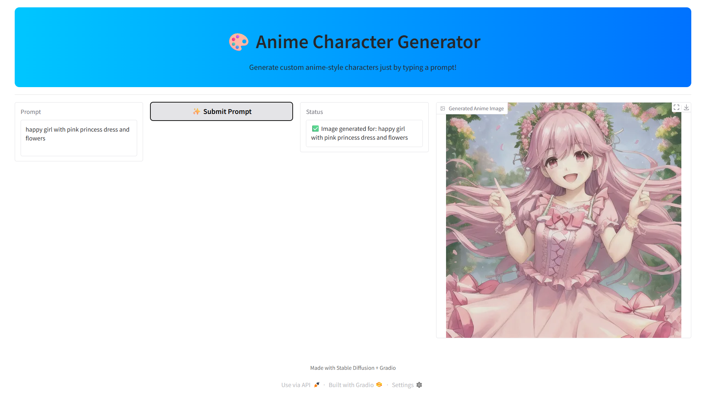

# 🎨 Anime Character Generator
Anime Character Generator is an AI-powered tool that creates custom anime-style characters from text prompts using the Stable Diffusion model (xyn-ai/anything-v4.0). With a stylish Gradio interface and full Colab support, you can easily generate unique anime visuals in seconds.
 
Generate beautiful anime-style characters using AI just by typing a prompt. Built using [Hugging Face Diffusers](https://huggingface.co/docs/diffusers/) and [Gradio](https://www.gradio.app/), and designed to run easily in **Google Colab**.

## 🚀 Features

- Input text prompts to generate anime characters
- Uses `xyn-ai/anything-v4.0` model
- Interactive UI with Gradio
- Works on CPU and GPU
- Launches in shareable Gradio app

## 🖼️ Demo Screenshot

 <!-- Upload screenshot to the repo -->

## 🛠️ Installation

```bash
pip install torch torchvision diffusers gradio
